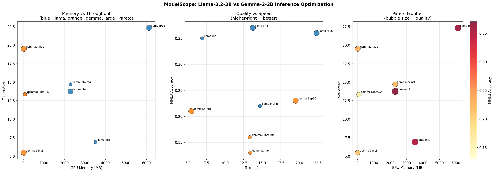

# ModelScope

> **Which quantization config gives the best speed, memory, and quality tradeoff for LLM inference on a budget GPU?**

This project answers that question by systematically benchmarking **Llama-3.2-3B** and **Gemma-2-2B** across 8 quantization configurations on a T4 GPU, then automatically identifying which configs are Pareto-optimal across all three axes at once.

---

## What the Results Look Like



**Reading the chart (top-left to bottom-right):**
- **Memory vs Throughput** -- shows the speed-memory tradeoff. Points in the upper-left are ideal (fast and small).
- **Quality vs Speed** -- shows accuracy vs inference speed. Upper-right is ideal.
- **Pareto Frontier** -- bubble size and color both encode quality. Larger/redder = better quality.
- **Perplexity** -- lower bars are better. Dashed lines show each model's FP16 baseline.

---

## The Short Answer

| Goal | Use This | Why |
|---|---|---|
| Fastest inference | `llama-fp16` | 22.3 tokens/sec, highest throughput |
| Smallest GPU footprint | `llama-int4` | 2299 MB vs 6128 MB FP16, same accuracy |
| Best overall tradeoff | `llama-int4` | 62% memory reduction, accuracy unchanged |

**`llama-int4` is Pareto-optimal** -- no other config beats it on all three axes simultaneously.

---

## Full Numbers

| Variant | GPU Memory | Speed | Latency (p50) | Accuracy (MMLU) | Consistency |
|---|---|---|---|---|---|
| llama-fp16 | 6128 MB | 22.34 tok/s | 47 ms | 0.36 | 0.45 |
| llama-int8 | 3515 MB | 6.92 tok/s | 144 ms | 0.35 | 0.54 |
| **llama-int4** | **2299 MB** | **13.75 tok/s** | **75 ms** | **0.37** | **0.34** |
| llama-int4-nf4 | 2299 MB | 14.72 tok/s | 66 ms | 0.22 | 0.31 |
| gemma2-fp16 | 24 MB | 19.51 tok/s | 50 ms | 0.23 | 0.43 |
| gemma2-int8 | 17 MB | 5.46 tok/s | 150 ms | 0.21 | 0.40 |
| gemma2-int4 | 83 MB | 13.39 tok/s | 80 ms | 0.13 | 0.35 |
| gemma2-int4-nf4 | 83 MB | 13.33 tok/s | 75 ms | 0.16 | 0.41 |

*5 runs per variant on Google Colab T4 GPU (16GB VRAM). Latency = TTFT p50.*

---

## Three Findings Worth Highlighting

**1. INT4 strictly beats INT8 -- never use INT8**

INT8 uses 53% more memory than INT4 (3515 MB vs 2299 MB), runs at half the speed (6.9 vs 13.75 tok/s), and gets the same MMLU score (0.35 vs 0.37). There is no scenario where INT8 is the right choice over INT4 for Llama at this scale.

**2. NF4 is worse than plain INT4 here**

NF4 (the format used in QLoRA) is theoretically more accurate than standard INT4. At 3B parameters it does the opposite -- MMLU drops 39% relative (0.22 vs 0.37) at identical memory. The quality tradeoff does not pay off at this model scale.

**3. Gemma is faster per MB of memory, but lower quality**

Gemma FP16 runs at 19.5 tok/s using far less measured VRAM than Llama FP16. But Gemma scores 36% lower on MMLU across every quantization config. If you're memory-constrained and can accept lower accuracy, Gemma is the right call. Otherwise, Llama-int4 is the better pick.

---

## How It Works

```
Input: 2 models x 4 quantization configs = 8 variants
         |
         v
Benchmark runner         Eval harness
- Latency (TTFT p50/p95) - MMLU accuracy (100 questions)
- Throughput (tok/sec)   - Consistency (ROUGE-L variance)
- Peak GPU memory        - Perplexity (WikiText-2)
         |                        |
         v                        v
    benchmark_results.csv    quality_results.csv
                    \            /
                     v          v
                   Pareto analysis
                  (3-axis non-dominated set)
                         |
                         v
              recommendation.json + 4-panel plot
```

---

## Key Engineering Details

**Resume from checkpoint.** Both the benchmark runner and eval harness check which variants are already saved to CSV before starting. If Colab disconnects mid-run, re-running picks up from where it left off -- no repeated work.

**Results written after each variant.** Each variant's result is saved to disk immediately, not batched at the end. This means a crash at variant 7 of 8 loses only one variant's work.

**Three quality metrics instead of one.** MMLU tests factual correctness. Consistency measures whether the model gives stable answers across repeated runs (ROUGE-L variance). Perplexity (WikiText-2) is the standard metric from the GPTQ and AWQ quantization papers and allows comparison with published results. Using all three catches cases where one metric is misleading.

**Pareto analysis across three axes simultaneously.** A config is only called "optimal" if no other config beats it on throughput AND memory AND quality at the same time. Rankings on a single axis are easy to game -- this finds the actual frontier.

---

## Project Structure

```
modelscope/
├── benchmarks/
│   ├── runner.py          # Main orchestrator -- runs all 8 variants
│   ├── latency.py         # TTFT measurement with torch.cuda.synchronize()
│   ├── memory.py          # Peak VRAM via reset_peak_memory_stats()
│   └── throughput.py      # Tokens/sec across batch sizes
├── eval/
│   ├── harness.py         # Main orchestrator -- runs all 3 quality metrics
│   ├── mmlu.py            # MMLU loader (cais/mmlu, 25 questions x 4 subjects)
│   ├── consistency.py     # ROUGE-L pairwise variance across 5 runs
│   └── relevance.py       # BERTScore F1 via sentence-transformers
├── analysis/
│   ├── pareto.py          # Non-dominated set across 3 axes
│   ├── visualize.py       # 4-panel matplotlib chart
│   └── recommend.py       # Normalized scoring + recommendation JSON
├── serve/
│   ├── api.py             # FastAPI inference endpoint
│   └── metrics.py         # Prometheus counters and gauges
├── models/
│   ├── configs.py         # MODEL_REGISTRY + BitsAndBytesConfig per variant
│   ├── loader.py          # Model loading with device_map=auto
│   └── generate.py        # Generation helpers
├── notebooks/
│   └── modelscope_colab.ipynb   # End-to-end reproducible run
├── tests/
│   ├── test_pareto.py
│   └── test_recommend.py
└── results/
    ├── benchmark_results.csv
    ├── quality_results.csv
    ├── recommendation.json
    └── plots/
        └── final_analysis.png
```

---

## Running It

Open [notebooks/modelscope_colab.ipynb](notebooks/modelscope_colab.ipynb) in Google Colab with a T4 GPU runtime.

**Before you start:**
- Set `HF_TOKEN` in Colab Secrets (left sidebar) -- needed for gated Llama and Gemma models
- Make sure T4 is selected: Runtime > Change runtime type > T4 GPU

**The notebook runs in order:**
1. Verify GPU + clone repo + install packages
2. Login to HuggingFace + check model access
3. Write and run the benchmark (~60-90 min)
4. Write and run the quality eval (~60-90 min)
5. Merge results, compute Pareto frontier, generate plot
6. Save to Google Drive + push to GitHub + download locally

---

## Stack

PyTorch, HuggingFace Transformers, bitsandbytes, accelerate, datasets, rouge-score, sentence-transformers, matplotlib, pandas, FastAPI, Prometheus, Google Colab T4
